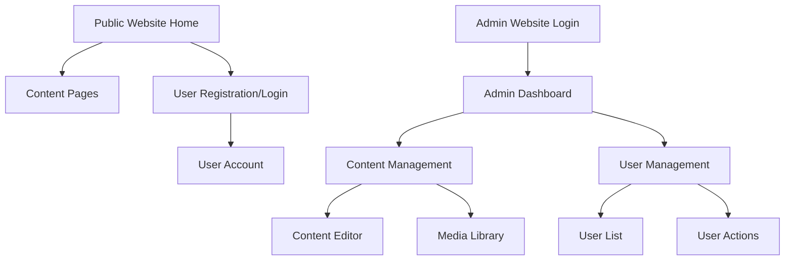

## 1. Product Overview
A dual-website system with a public-facing user website and a separate admin website for content management. Users interact with the main website without any awareness of the admin interface, while administrators manage content through a completely separate admin portal.

## 2. Core Features

### 2.1 User Roles
| Role | Registration Method | Core Permissions |
|------|---------------------|------------------|
| Website User | Email registration | Browse content, interact with features |
| Admin | Manual creation by system | Full content management, user management |

### 2.2 Feature Module
The system consists of two separate websites:

**Public Website:**
1. **Home page**: hero section, navigation, featured content display
2. **Content pages**: various content sections based on website purpose
3. **User account page**: profile management, settings

**Admin Website (separate domain/subdomain):**
1. **Admin dashboard**: overview, analytics, quick actions
2. **Content management**: create, edit, delete content
3. **User management**: view users, manage permissions

### 2.3 Page Details
| Page Name | Module Name | Feature description |
|-----------|-------------|---------------------|
| Home page | Hero section | Display main value proposition with rotating content |
| Home page | Navigation | Main menu with links to key sections |
| Home page | Featured content | Display highlighted content items |
| Content pages | Content display | Show formatted content with images and text |
| User account | Profile settings | Update personal information and preferences |
| Admin dashboard | Analytics overview | View website metrics and user statistics |
| Admin dashboard | Quick actions | Access frequently used admin functions |
| Content management | Content editor | Create and edit content with rich text editor |
| Content management | Media library | Upload and manage images and files |
| User management | User list | View all registered users with search and filter |
| User management | User actions | Enable/disable user accounts |

## 3. Core Process
**User Flow:**
1. User visits public website homepage
2. User browses content sections
3. User can register/login to access personal features
4. User manages profile settings

**Admin Flow (separate website):**
1. Admin logs into admin portal
2. Admin views dashboard overview
3. Admin manages content through content management tools
4. Admin monitors user activity and manages users

## 4. User Interface Design
### 4.1 Design Style
- **Public Website**: Modern, clean design with engaging visuals
  - Primary colors: Professional blue (#2563EB) and white
  - Secondary colors: Light gray (#F3F4F6) and accent color
  - Button style: Rounded corners with hover effects
  - Font: Sans-serif family (Inter or similar), 16px base size
  - Layout: Card-based with responsive grid system
  - Icons: Modern line icons with consistent styling

- **Admin Website**: Functional, data-focused design
  - Primary colors: Dark theme with blue accents
  - Clean tables and forms for data management
  - Sidebar navigation for easy access to admin functions

### 4.2 Page Design Overview
| Page Name | Module Name | UI Elements |
|-----------|-------------|-------------|
| Home page | Hero section | Full-width banner with animated text, call-to-action button |
| Home page | Navigation | Sticky header with logo, menu items, user account icon |
| Home page | Featured content | Grid layout with card components, hover animations |
| Content pages | Content display | Clean typography, responsive images, breadcrumb navigation |
| User account | Profile settings | Form inputs with validation, save button, success messages |
| Admin dashboard | Analytics overview | Card widgets with key metrics, charts and graphs |
| Admin dashboard | Quick actions | Button grid with icons for common tasks |
| Content management | Content editor | Rich text editor with formatting toolbar, preview mode |
| Content management | Media library | Grid view with thumbnails, upload drag-and-drop area |
| User management | User list | Data table with search box, pagination, action buttons |

### 4.3 Responsiveness
Desktop-first design approach with mobile responsiveness. Both websites will adapt to different screen sizes with touch-friendly interactions for mobile devices.