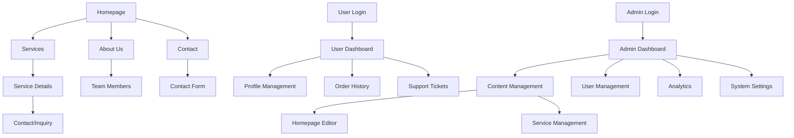

## 1. Product Overview
A professional frontend website with dual interfaces - a public-facing user portal and a comprehensive admin dashboard. The platform enables businesses to showcase their services/products to customers while providing administrators with powerful tools to manage content, users, and system settings.

Target market: Small to medium businesses needing a professional online presence with backend management capabilities.

## 2. Core Features

### 2.1 User Roles
| Role | Registration Method | Core Permissions |
|------|---------------------|------------------|
| Visitor | No registration required | Browse public content, view products/services, contact business |
| Customer | Email registration | All visitor permissions + account management, order history, support tickets |
| Admin | Manual creation by super admin | Full system access, content management, user management, analytics |

### 2.2 Feature Module
The website consists of the following main pages:

**User Portal:**
1. **Homepage**: Hero banner, services showcase, testimonials, contact CTA
2. **About Us**: Company information, team members, mission/vision
3. **Services/Products**: Service listings, detailed service pages, pricing
4. **Contact**: Contact form, business hours, location map
5. **User Dashboard**: Profile management, order history, support tickets

**Admin Dashboard:**
1. **Admin Dashboard**: Analytics overview, recent activities, system status
2. **Content Management**: Homepage editor, about page editor, service management
3. **User Management**: Customer list, user roles, activity logs
4. **Analytics**: Traffic statistics, conversion metrics, user behavior
5. **System Settings**: General settings, email configuration, backup management

### 2.3 Page Details
| Page Name | Module Name | Feature description |
|-----------|-------------|---------------------|
| Homepage | Hero Section | Display full-width banner with business value proposition, animated text, call-to-action buttons |
| Homepage | Services Showcase | Grid layout of 3-6 key services with icons, brief descriptions, and "Learn More" links |
| Homepage | Testimonials | Carousel of customer reviews with photos, names, and ratings |
| Homepage | Contact CTA | Prominent contact section with phone, email, and consultation booking button |
| About Us | Company Info | Rich text editor content for company history, mission, vision, and values |
| About Us | Team Members | Grid of team member cards with photos, titles, and brief bios |
| Services | Service Listings | Filterable grid of all services with categories, pricing, and availability |
| Services | Service Details | Individual service pages with comprehensive descriptions, features, pricing tables, and inquiry forms |
| Contact | Contact Form | Multi-field form with name, email, phone, subject, message, and file attachment capability |
| Contact | Business Info | Display business hours, address, phone, email with clickable contact actions |
| Contact | Location Map | Interactive map showing business location with directions integration |
| User Dashboard | Profile Management | Edit personal information, change password, update preferences |
| User Dashboard | Order History | List of past orders with status tracking, invoices, and reorder functionality |
| User Dashboard | Support Tickets | Create, view, and manage support requests with status updates |
| Admin Dashboard | Analytics Overview | Key metrics cards showing total users, orders, revenue, conversion rates |
| Admin Dashboard | Recent Activities | Timeline of recent user actions, orders, and system events |
| Content Management | Homepage Editor | Drag-and-drop interface to edit hero banner, services, testimonials |
| Content Management | Service Management | Add/edit/delete services, manage categories, set pricing and availability |
| User Management | Customer List | Searchable and filterable table of all users with role management |
| Analytics | Traffic Statistics | Page views, unique visitors, bounce rates, traffic sources over time |
| System Settings | General Settings | Site title, logo, colors, contact information configuration |

## 3. Core Process

**Visitor Flow:**
1. Land on Homepage → Browse services → View service details → Contact business → (Optional) Register account

**Customer Flow:**
1. Register/Login → Browse services → Place orders → Track orders → Request support → Manage profile

**Admin Flow:**
1. Login to Admin Dashboard → Monitor analytics → Manage content → Handle users → Configure system

## 4. User Interface Design

### 4.1 Design Style
- **Primary Colors**: Professional blue (#1e40af) and white, with gray accents (#6b7280)
- **Secondary Colors**: Success green (#10b981), warning amber (#f59e0b), error red (#ef4444)
- **Button Style**: Modern rounded corners (8px radius), subtle shadows, hover animations
- **Typography**: Inter font family, 16px base size, hierarchical sizing (14px small, 20px large, 24px heading)
- **Layout Style**: Card-based design with consistent spacing (8px grid system), top navigation with sticky header
- **Icons**: Heroicons for consistency, filled variants for active states

### 4.2 Page Design Overview
| Page Name | Module Name | UI Elements |
| Homepage | Hero Section | Full-width gradient background, animated headline text, dual CTA buttons with hover effects |
| Homepage | Services Showcase | 3-column responsive grid, icon circles with brand colors, card hover animations |
| Services | Service Listings | Filter sidebar, search bar, card grid with images, pricing badges, quick view modal |
| User Dashboard | Profile Management | Form with avatar upload, tabbed interface for different sections, save confirmation |
| Admin Dashboard | Analytics Overview | Metric cards with trend indicators, line charts for time series data, color-coded status |

### 4.3 Responsiveness
- **Desktop-first approach**: Optimized for 1920x1080 and 1366x768 resolutions
- **Mobile adaptation**: Responsive breakpoints at 768px and 480px
- **Touch optimization**: Larger tap targets (44px minimum) on mobile, swipe gestures for carousels
- **Performance**: Progressive enhancement, lazy loading for images, optimized asset delivery