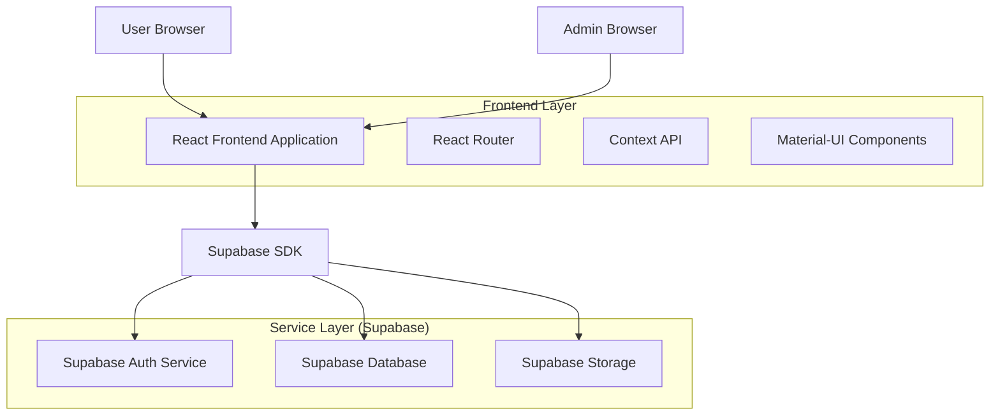
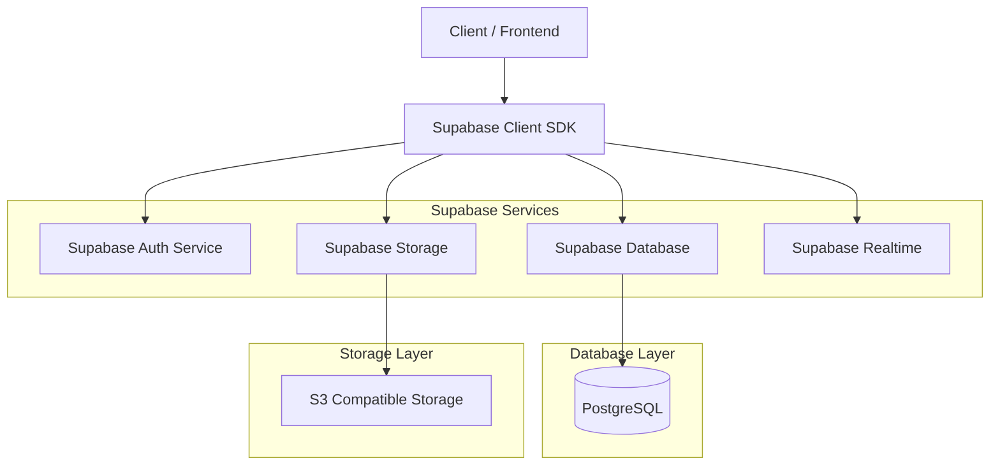
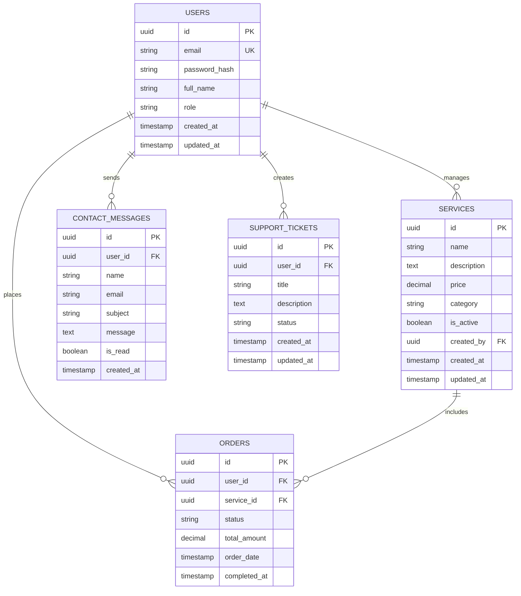

## 1. Architecture Design



## 2. Technology Description

- **Frontend**: React@18 + Material-UI@5 + Vite
- **Initialization Tool**: vite-init
- **Backend**: Supabase (Backend-as-a-Service)
- **Database**: PostgreSQL (via Supabase)
- **Authentication**: Supabase Auth
- **File Storage**: Supabase Storage
- **State Management**: React Context API + useReducer
- **Routing**: React Router v6
- **Styling**: Material-UI with custom theme

## 3. Route Definitions

| Route | Purpose |
|-------|---------|
| `/` | Homepage with hero section, services showcase, testimonials |
| `/about` | Company information, team members, mission/vision |
| `/services` | Service listings with categories and filtering |
| `/services/:id` | Individual service details page |
| `/contact` | Contact form and business information |
| `/login` | User authentication page |
| `/register` | User registration page |
| `/dashboard` | User dashboard for profile and orders |
| `/admin` | Admin dashboard with analytics overview |
| `/admin/content` | Content management interface |
| `/admin/users` | User management panel |
| `/admin/analytics` | Analytics and reporting dashboard |
| `/admin/settings` | System configuration page |

## 4. API Definitions

### 4.1 Authentication APIs

**User Registration**
```
POST /auth/v1/signup
```

Request:
| Param Name | Param Type | isRequired | Description |
|------------|------------|-------------|-------------|
| email | string | true | User email address |
| password | string | true | User password (min 6 characters) |
| full_name | string | true | User's full name |

**User Login**
```
POST /auth/v1/token?grant_type=password
```

Request:
| Param Name | Param Type | isRequired | Description |
|------------|------------|-------------|-------------|
| email | string | true | User email address |
| password | string | true | User password |

### 4.2 Content Management APIs

**Get Homepage Content**
```
GET /rest/v1/homepage_content
```

**Update Service**
```
PATCH /rest/v1/services?id=eq.{id}
```

Request:
| Param Name | Param Type | isRequired | Description |
|------------|------------|-------------|-------------|
| name | string | false | Service name |
| description | string | false | Service description |
| price | number | false | Service price |
| category | string | false | Service category |

### 4.3 User Management APIs

**Get Users List**
```
GET /rest/v1/users?select=*&order=created_at.desc
```

**Update User Role**
```
PATCH /rest/v1/users?id=eq.{id}
```

Request:
| Param Name | Param Type | isRequired | Description |
|------------|------------|-------------|-------------|
| role | string | true | User role (customer/admin) |

## 5. Server Architecture Diagram



## 6. Data Model

### 6.1 Data Model Definition



### 6.2 Data Definition Language

**Users Table**
```sql
-- Create users table
CREATE TABLE users (
    id UUID PRIMARY KEY DEFAULT gen_random_uuid(),
    email VARCHAR(255) UNIQUE NOT NULL,
    password_hash VARCHAR(255) NOT NULL,
    full_name VARCHAR(255) NOT NULL,
    role VARCHAR(20) DEFAULT 'customer' CHECK (role IN ('customer', 'admin')),
    created_at TIMESTAMP WITH TIME ZONE DEFAULT NOW(),
    updated_at TIMESTAMP WITH TIME ZONE DEFAULT NOW()
);

-- Create index for faster queries
CREATE INDEX idx_users_email ON users(email);
CREATE INDEX idx_users_role ON users(role);
```

**Services Table**
```sql
-- Create services table
CREATE TABLE services (
    id UUID PRIMARY KEY DEFAULT gen_random_uuid(),
    name VARCHAR(255) NOT NULL,
    description TEXT,
    price DECIMAL(10,2) NOT NULL,
    category VARCHAR(100),
    is_active BOOLEAN DEFAULT true,
    created_by UUID REFERENCES users(id),
    created_at TIMESTAMP WITH TIME ZONE DEFAULT NOW(),
    updated_at TIMESTAMP WITH TIME ZONE DEFAULT NOW()
);

-- Create indexes
CREATE INDEX idx_services_category ON services(category);
CREATE INDEX idx_services_active ON services(is_active);
```

**Contact Messages Table**
```sql
-- Create contact messages table
CREATE TABLE contact_messages (
    id UUID PRIMARY KEY DEFAULT gen_random_uuid(),
    user_id UUID REFERENCES users(id),
    name VARCHAR(255) NOT NULL,
    email VARCHAR(255) NOT NULL,
    subject VARCHAR(255),
    message TEXT NOT NULL,
    is_read BOOLEAN DEFAULT false,
    created_at TIMESTAMP WITH TIME ZONE DEFAULT NOW()
);

-- Create indexes
CREATE INDEX idx_contact_messages_read ON contact_messages(is_read);
CREATE INDEX idx_contact_messages_created ON contact_messages(created_at);
```

**Orders Table**
```sql
-- Create orders table
CREATE TABLE orders (
    id UUID PRIMARY KEY DEFAULT gen_random_uuid(),
    user_id UUID REFERENCES users(id),
    service_id UUID REFERENCES services(id),
    status VARCHAR(50) DEFAULT 'pending' CHECK (status IN ('pending', 'confirmed', 'completed', 'cancelled')),
    total_amount DECIMAL(10,2) NOT NULL,
    order_date TIMESTAMP WITH TIME ZONE DEFAULT NOW(),
    completed_at TIMESTAMP WITH TIME ZONE
);

-- Create indexes
CREATE INDEX idx_orders_user ON orders(user_id);
CREATE INDEX idx_orders_status ON orders(status);
CREATE INDEX idx_orders_date ON orders(order_date);
```

**Support Tickets Table**
```sql
-- Create support tickets table
CREATE TABLE support_tickets (
    id UUID PRIMARY KEY DEFAULT gen_random_uuid(),
    user_id UUID REFERENCES users(id),
    title VARCHAR(255) NOT NULL,
    description TEXT NOT NULL,
    status VARCHAR(50) DEFAULT 'open' CHECK (status IN ('open', 'in_progress', 'resolved', 'closed')),
    created_at TIMESTAMP WITH TIME ZONE DEFAULT NOW(),
    updated_at TIMESTAMP WITH TIME ZONE DEFAULT NOW()
);

-- Create indexes
CREATE INDEX idx_tickets_user ON support_tickets(user_id);
CREATE INDEX idx_tickets_status ON support_tickets(status);
```

**Row Level Security (RLS) Policies**
```sql
-- Enable RLS on all tables
ALTER TABLE users ENABLE ROW LEVEL SECURITY;
ALTER TABLE services ENABLE ROW LEVEL SECURITY;
ALTER TABLE contact_messages ENABLE ROW LEVEL SECURITY;
ALTER TABLE orders ENABLE ROW LEVEL SECURITY;
ALTER TABLE support_tickets ENABLE ROW LEVEL SECURITY;

-- Grant basic read access to anonymous users
GRANT SELECT ON services TO anon;
GRANT SELECT ON users TO anon;

-- Grant full access to authenticated users
GRANT ALL PRIVILEGES ON services TO authenticated;
GRANT ALL PRIVILEGES ON contact_messages TO authenticated;
GRANT ALL PRIVILEGES ON orders TO authenticated;
GRANT ALL PRIVILEGES ON support_tickets TO authenticated;

-- Create policies for users table
CREATE POLICY "Users can view their own profile" ON users FOR SELECT USING (auth.uid() = id);
CREATE POLICY "Admins can view all users" ON users FOR SELECT USING (EXISTS (
  SELECT 1 FROM users WHERE id = auth.uid() AND role = 'admin'
));

-- Create policies for services table
CREATE POLICY "Anyone can view active services" ON services FOR SELECT USING (is_active = true);
CREATE POLICY "Admins can manage all services" ON services FOR ALL USING (EXISTS (
  SELECT 1 FROM users WHERE id = auth.uid() AND role = 'admin'
));
```