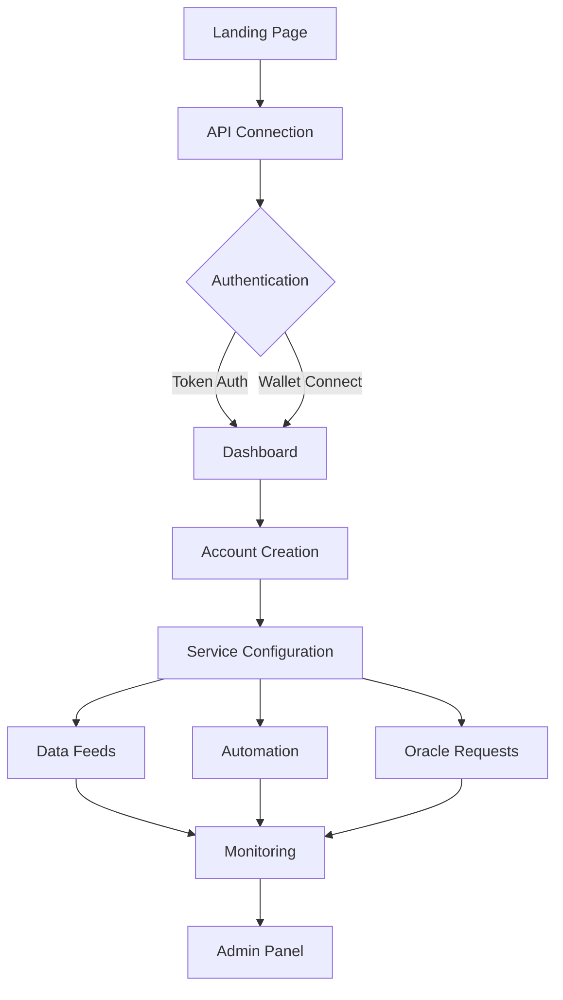

## 1. Product Overview
A centralized service layer platform that provides Chainlink-style oracle services, data feeds, and automation infrastructure for Neo N3 blockchain. The platform operates as a comprehensive middleware solution, offering decentralized data infrastructure with enterprise-grade reliability and multi-tenant capabilities.

Target users include blockchain developers, DeFi protocols, and enterprises needing reliable off-chain data integration with on-chain smart contracts. The platform solves the oracle problem by providing secure, reliable, and decentralized data feeds while maintaining the performance and scalability required for production blockchain applications.

## 2. Core Features

### 2.1 User Roles
| Role | Registration Method | Core Permissions |
|------|---------------------|------------------|
| Developer | Email/wallet registration | Create accounts, manage data feeds, access API |
| Enterprise User | Invitation-based upgrade | Advanced analytics, custom integrations, priority support |
| Admin | System assignment | Full system access, user management, configuration |
| Service Operator | Internal registration | Monitor services, manage infrastructure, view metrics |

### 2.2 Feature Module
The service layer requirements consist of the following main pages:
1. **Landing page**: Hero section, service catalog, connection interface, live status display
2. **Dashboard**: System overview, account management, service monitoring, real-time metrics
3. **Data feeds**: Price feeds, data aggregation, oracle requests, signer management
4. **Automation**: Trigger configuration, job scheduling, workflow management
5. **Admin panel**: System configuration, user management, analytics, service health

### 2.3 Page Details
| Page Name | Module Name | Feature description |
|-----------|-------------|---------------------|
| Landing page | Hero section | Display platform value proposition with gradient text effects and animated background grid |
| Landing page | Service catalog | Showcase oracle, data feeds, automation, gas bank, and JAM services with interactive cards |
| Landing page | Connection interface | API endpoint configuration, token authentication, tenant selection with real-time status checking |
| Landing page | Live status display | Neo blockchain integration showing latest height, node lag, stable height, and indexed timestamps |
| Dashboard | System overview | Real-time service metrics, module health status, version information, and performance indicators |
| Dashboard | Account management | Create and manage workspace accounts, wallet connection, tenant-scoped project organization |
| Dashboard | Service monitoring | Monitor data feeds, DataLink channels, VRF requests, and oracle operations with retry capabilities |
| Dashboard | Real-time metrics | Prometheus-integrated metrics display with configurable thresholds and performance tracking |
| Data feeds | Price feed management | Configure aggregated price feeds with custom aggregation strategies and signer sets |
| Data feeds | Oracle requests | Submit and track oracle data requests with callback handling and fee management |
| Data feeds | Data aggregation | Set up custom aggregation logic for multiple data sources with configurable parameters |
| Automation | Trigger configuration | Create event-based triggers for automated workflows and scheduled operations |
| Automation | Job scheduling | Configure recurring jobs with cron expressions and dependency management |
| Automation | Workflow management | Visual workflow builder for complex multi-step automation processes |
| Admin panel | System configuration | Configure service parameters, quotas, and system-wide settings |
| Admin panel | User management | Manage user accounts, permissions, and role-based access control |
| Admin panel | Analytics | View system usage statistics, performance metrics, and operational insights |
| Admin panel | Service health | Monitor all services, retry failed operations, and manage dead letter queues |

## 3. Core Process
**Developer Flow**: User lands on homepage → Connects to API endpoint → Creates account → Configures data feeds → Monitors operations via dashboard → Manages automation workflows

**Enterprise Flow**: Admin invitation → Enterprise onboarding → Custom integration setup → Advanced analytics configuration → Priority support access

**Service Operator Flow**: System login → Infrastructure monitoring → Service health management → Performance optimization → Incident response

## 4. User Interface Design

### 4.1 Design Style
- **Primary colors**: Neo green (#58bf00) and tech cyan (#00e5ff) for gradient effects
- **Background**: Dark theme (#04060f) with futuristic grid overlay
- **Card styling**: Glass-morphism effect with subtle borders and shadows
- **Typography**: Inter font family with gradient text for headings
- **Button styles**: Gradient primary buttons, ghost secondary buttons with rounded corners
- **Layout**: Card-based grid system with responsive breakpoints
- **Animations**: Subtle hover effects and smooth transitions

### 4.2 Page Design Overview
| Page Name | Module Name | UI Elements |
|-----------|-------------|-------------|
| Landing page | Hero section | Gradient text heading, animated background grid, dual-tone color scheme with Neo green and tech cyan |
| Landing page | Service catalog | Card grid layout with glass-morphism effects, subtle borders, and hover animations |
| Landing page | Connection interface | Form inputs with rounded corners, real-time status indicators, and connection testing |
| Dashboard | System overview | Metric cards with status indicators, module health chips, and performance charts |
| Dashboard | Account management | Wallet connection modal, account creation forms, and tenant selection dropdown |
| Data feeds | Price feed cards | Interactive cards showing feed pairs, aggregation methods, and signer information |
| Automation | Workflow builder | Visual flow diagram with drag-and-drop interface and connection lines |
| Admin panel | Service health | Status table with color-coded indicators, retry buttons, and error details |

### 4.3 Responsiveness
Desktop-first design approach with mobile adaptation. Touch interaction optimization for tablet devices. Responsive grid system that collapses to single column on mobile. Touch-friendly button sizes and form inputs for mobile users.