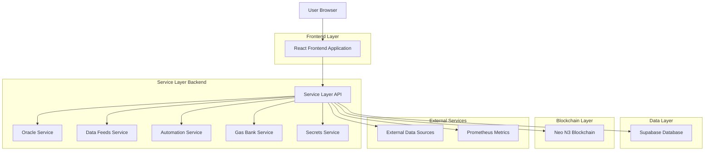
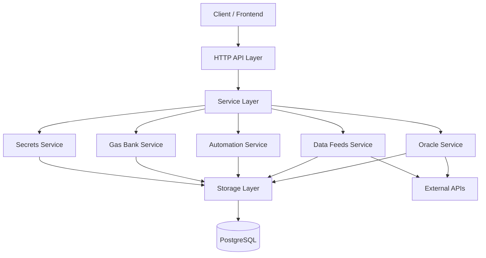
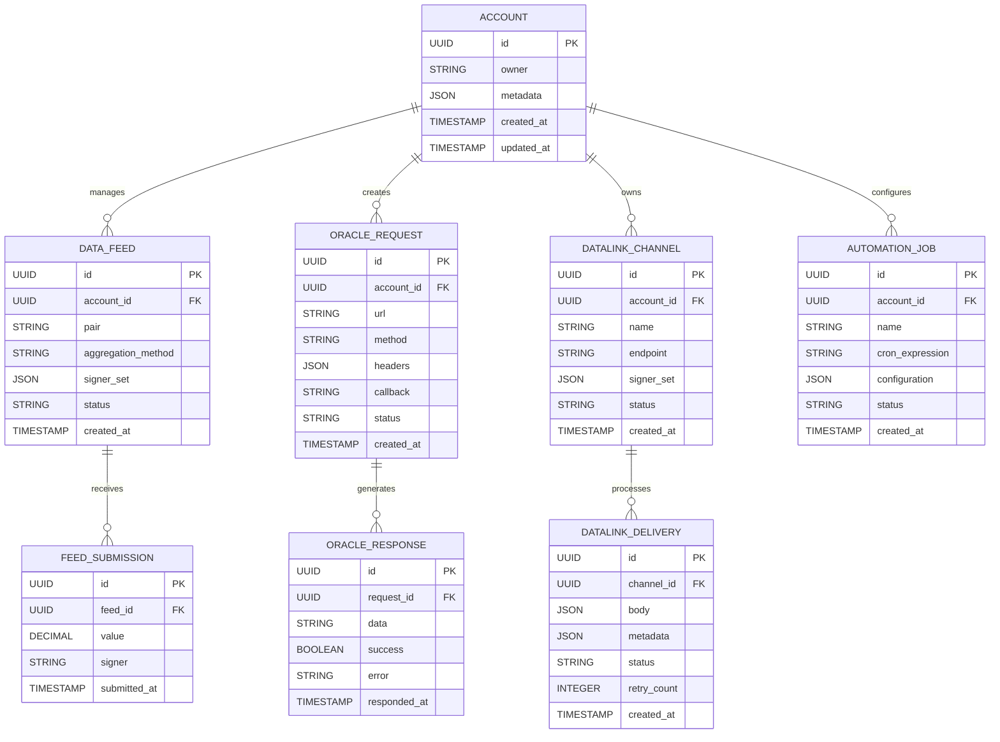

## 1. Architecture design



## 2. Technology Description
- **Frontend**: React@18 + TypeScript + Tailwind CSS@3 + Vite
- **Initialization Tool**: vite-init
- **Backend**: Go-based Service Layer with modular architecture
- **Database**: Supabase (PostgreSQL) with Row Level Security
- **Blockchain**: Neo N3 integration via RPC nodes
- **Metrics**: Prometheus + Grafana dashboard
- **Authentication**: JWT-based with wallet connect support

## 3. Route definitions
| Route | Purpose |
|-------|---------|
| / | Landing page with service catalog and connection interface |
| /dashboard | Main dashboard with system overview and account management |
| /dashboard/data-feeds | Data feeds configuration and monitoring |
| /dashboard/automation | Automation workflows and trigger management |
| /dashboard/admin | Admin panel for system configuration and user management |
| /auth/login | Authentication page for token-based login |
| /auth/wallet | Wallet connection interface |
| /system/status | System health and service status endpoint |
| /system/descriptors | Service discovery and capability advertisement |

## 4. API definitions

### 4.1 Core API

**User Authentication**
```
POST /api/auth/login
```

Request:
| Param Name | Param Type | isRequired | Description |
|------------|-------------|-------------|-------------|
| username | string | true | Admin username |
| password | string | true | Admin password |

Response:
| Param Name | Param Type | Description |
|------------|-------------|-------------|
| token | string | JWT authentication token |
| role | string | User role (admin, user) |
| expires_at | number | Token expiration timestamp |

Example:
```json
{
  "username": "admin",
  "password": "changeme"
}
```

**Account Management**
```
POST /api/accounts
GET /api/accounts
GET /api/accounts/:id
```

Request (POST):
| Param Name | Param Type | isRequired | Description |
|------------|-------------|-------------|-------------|
| owner | string | true | Account owner identifier |
| metadata | object | false | Additional account metadata |

**Oracle Requests**
```
POST /api/accounts/:account_id/oracle/requests
GET /api/accounts/:account_id/oracle/requests
```

Request (POST):
| Param Name | Param Type | isRequired | Description |
|------------|-------------|-------------|-------------|
| url | string | true | Data source URL |
| method | string | true | HTTP method (GET, POST) |
| headers | object | false | Request headers |
| body | string | false | Request body |
| callback | string | true | Callback contract address |

**Data Feeds**
```
POST /api/accounts/:account_id/datafeeds
GET /api/accounts/:account_id/datafeeds
PUT /api/accounts/:account_id/datafeeds/:id/aggregation
```

**DataLink Channels**
```
POST /api/accounts/:account_id/datalink/channels
GET /api/accounts/:account_id/datalink/channels
POST /api/accounts/:account_id/datalink/channels/:id/deliveries
```

## 5. Server architecture diagram



## 6. Data model

### 6.1 Data model definition



### 6.2 Data Definition Language

**Accounts Table**
```sql
-- create table
CREATE TABLE accounts (
    id UUID PRIMARY KEY DEFAULT gen_random_uuid(),
    owner VARCHAR(255) NOT NULL,
    metadata JSONB DEFAULT '{}',
    created_at TIMESTAMP WITH TIME ZONE DEFAULT NOW(),
    updated_at TIMESTAMP WITH TIME ZONE DEFAULT NOW()
);

-- create index
CREATE INDEX idx_accounts_owner ON accounts(owner);
CREATE INDEX idx_accounts_created_at ON accounts(created_at DESC);
```

**Data Feeds Table**
```sql
-- create table
CREATE TABLE data_feeds (
    id UUID PRIMARY KEY DEFAULT gen_random_uuid(),
    account_id UUID NOT NULL REFERENCES accounts(id),
    pair VARCHAR(100) NOT NULL,
    aggregation_method VARCHAR(50) DEFAULT 'median',
    signer_set JSONB DEFAULT '[]',
    status VARCHAR(20) DEFAULT 'active',
    created_at TIMESTAMP WITH TIME ZONE DEFAULT NOW(),
    updated_at TIMESTAMP WITH TIME ZONE DEFAULT NOW()
);

-- create index
CREATE INDEX idx_data_feeds_account_id ON data_feeds(account_id);
CREATE INDEX idx_data_feeds_pair ON data_feeds(pair);
CREATE INDEX idx_data_feeds_status ON data_feeds(status);
```

**Oracle Requests Table**
```sql
-- create table
CREATE TABLE oracle_requests (
    id UUID PRIMARY KEY DEFAULT gen_random_uuid(),
    account_id UUID NOT NULL REFERENCES accounts(id),
    url TEXT NOT NULL,
    method VARCHAR(10) DEFAULT 'GET',
    headers JSONB DEFAULT '{}',
    body TEXT,
    callback VARCHAR(255),
    status VARCHAR(20) DEFAULT 'pending',
    fee_amount BIGINT DEFAULT 0,
    created_at TIMESTAMP WITH TIME ZONE DEFAULT NOW(),
    updated_at TIMESTAMP WITH TIME ZONE DEFAULT NOW()
);

-- create index
CREATE INDEX idx_oracle_requests_account_id ON oracle_requests(account_id);
CREATE INDEX idx_oracle_requests_status ON oracle_requests(status);
CREATE INDEX idx_oracle_requests_created_at ON oracle_requests(created_at DESC);
```

**DataLink Channels Table**
```sql
-- create table
CREATE TABLE datalink_channels (
    id UUID PRIMARY KEY DEFAULT gen_random_uuid(),
    account_id UUID NOT NULL REFERENCES accounts(id),
    name VARCHAR(255) NOT NULL,
    endpoint TEXT NOT NULL,
    signer_set JSONB DEFAULT '[]',
    status VARCHAR(20) DEFAULT 'active',
    metadata JSONB DEFAULT '{}',
    created_at TIMESTAMP WITH TIME ZONE DEFAULT NOW(),
    updated_at TIMESTAMP WITH TIME ZONE DEFAULT NOW()
);

-- create index
CREATE INDEX idx_datalink_channels_account_id ON datalink_channels(account_id);
CREATE INDEX idx_datalink_channels_name ON datalink_channels(name);
CREATE INDEX idx_datalink_channels_status ON datalink_channels(status);
```

**Supabase Row Level Security Policies**
```sql
-- Enable RLS
ALTER TABLE accounts ENABLE ROW LEVEL SECURITY;
ALTER TABLE data_feeds ENABLE ROW LEVEL SECURITY;
ALTER TABLE oracle_requests ENABLE ROW LEVEL SECURITY;
ALTER TABLE datalink_channels ENABLE ROW LEVEL SECURITY;

-- Grant basic read access to anon role
GRANT SELECT ON accounts TO anon;
GRANT SELECT ON data_feeds TO anon;
GRANT SELECT ON oracle_requests TO anon;
GRANT SELECT ON datalink_channels TO anon;

-- Grant full access to authenticated role
GRANT ALL PRIVILEGES ON accounts TO authenticated;
GRANT ALL PRIVILEGES ON data_feeds TO authenticated;
GRANT ALL PRIVILEGES ON oracle_requests TO authenticated;
GRANT ALL PRIVILEGES ON datalink_channels TO authenticated;

-- Create policies for tenant isolation
CREATE POLICY "Users can view own accounts" ON accounts
    FOR SELECT USING (auth.uid() = id OR owner = auth.jwt() ->> 'sub');

CREATE POLICY "Users can manage own data feeds" ON data_feeds
    USING (account_id IN (SELECT id FROM accounts WHERE owner = auth.jwt() ->> 'sub'));

CREATE POLICY "Users can manage own oracle requests" ON oracle_requests
    USING (account_id IN (SELECT id FROM accounts WHERE owner = auth.jwt() ->> 'sub'));
```