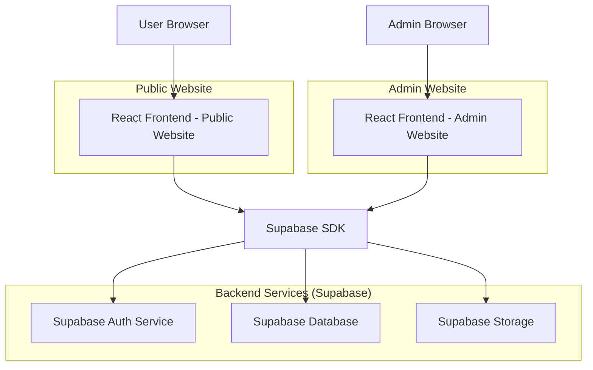
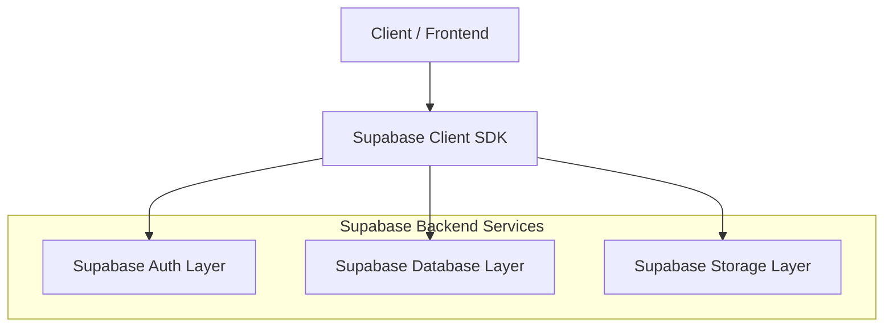
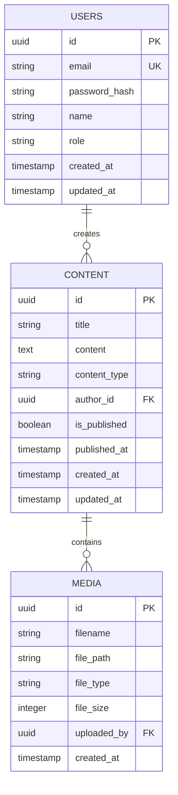

## 1.Architecture design



## 2.Technology Description
- Frontend: React@18 + tailwindcss@3 + vite
- Initialization Tool: vite-init (separate instances for public and admin websites)
- Backend: Supabase (handles both authentication and database)
- Database: PostgreSQL (via Supabase)
- Storage: Supabase Storage for media files

## 3.Route definitions

**Public Website Routes:**
| Route | Purpose |
|-------|---------|
| / | Home page with hero section and featured content |
| /content/:id | Individual content pages |
| /register | User registration page |
| /login | User login page |
| /profile | User profile and settings page |
| /about | About page with website information |

**Admin Website Routes:**
| Route | Purpose |
|-------|---------|
| /admin/login | Admin authentication page |
| /admin/dashboard | Main admin dashboard with analytics |
| /admin/content | Content management listing page |
| /admin/content/new | Create new content page |
| /admin/content/edit/:id | Edit existing content page |
| /admin/users | User management page |
| /admin/media | Media library management |

## 4.API definitions

### 4.1 Core API

**Authentication APIs (via Supabase):**
```
POST /auth/v1/signup
POST /auth/v1/token
POST /auth/v1/logout
GET /auth/v1/user
```

**Database APIs (via Supabase):**
```
GET /rest/v1/content
POST /rest/v1/content
PATCH /rest/v1/content
DELETE /rest/v1/content

GET /rest/v1/users
PATCH /rest/v1/users
```

**Storage APIs (via Supabase):**
```
POST /storage/v1/object
DELETE /storage/v1/object
GET /storage/v1/object
```

## 5.Server architecture diagram



## 6.Data model

### 6.1 Data model definition


### 6.2 Data Definition Language

**Users Table (users)**
```sql
-- create table
CREATE TABLE users (
    id UUID PRIMARY KEY DEFAULT gen_random_uuid(),
    email VARCHAR(255) UNIQUE NOT NULL,
    password_hash VARCHAR(255) NOT NULL,
    name VARCHAR(100) NOT NULL,
    role VARCHAR(20) DEFAULT 'user' CHECK (role IN ('user', 'admin')),
    created_at TIMESTAMP WITH TIME ZONE DEFAULT NOW(),
    updated_at TIMESTAMP WITH TIME ZONE DEFAULT NOW()
);

-- create indexes
CREATE INDEX idx_users_email ON users(email);
CREATE INDEX idx_users_role ON users(role);

-- grant permissions
GRANT SELECT ON users TO anon;
GRANT ALL PRIVILEGES ON users TO authenticated;
```

**Content Table (content)**
```sql
-- create table
CREATE TABLE content (
    id UUID PRIMARY KEY DEFAULT gen_random_uuid(),
    title VARCHAR(255) NOT NULL,
    content TEXT,
    content_type VARCHAR(50) DEFAULT 'article',
    author_id UUID REFERENCES users(id),
    is_published BOOLEAN DEFAULT false,
    published_at TIMESTAMP WITH TIME ZONE,
    created_at TIMESTAMP WITH TIME ZONE DEFAULT NOW(),
    updated_at TIMESTAMP WITH TIME ZONE DEFAULT NOW()
);

-- create indexes
CREATE INDEX idx_content_author ON content(author_id);
CREATE INDEX idx_content_published ON content(is_published);
CREATE INDEX idx_content_type ON content(content_type);
CREATE INDEX idx_content_created_at ON content(created_at DESC);

-- grant permissions
GRANT SELECT ON content TO anon;
GRANT ALL PRIVILEGES ON content TO authenticated;
```

**Media Table (media)**
```sql
-- create table
CREATE TABLE media (
    id UUID PRIMARY KEY DEFAULT gen_random_uuid(),
    filename VARCHAR(255) NOT NULL,
    file_path VARCHAR(500) NOT NULL,
    file_type VARCHAR(100),
    file_size INTEGER,
    uploaded_by UUID REFERENCES users(id),
    created_at TIMESTAMP WITH TIME ZONE DEFAULT NOW()
);

-- create indexes
CREATE INDEX idx_media_uploaded_by ON media(uploaded_by);
CREATE INDEX idx_media_file_type ON media(file_type);

-- grant permissions
GRANT SELECT ON media TO anon;
GRANT ALL PRIVILEGES ON media TO authenticated;
```

**Row Level Security Policies**
```sql
-- Content visibility policy (public can view published content)
CREATE POLICY "Public can view published content" ON content
    FOR SELECT USING (is_published = true);

-- Content management policy (authors can manage their own content)
CREATE POLICY "Authors can manage their content" ON content
    FOR ALL USING (auth.uid() = author_id);

-- Admin content policy (admins can manage all content)
CREATE POLICY "Admins can manage all content" ON content
    FOR ALL USING (EXISTS (
        SELECT 1 FROM users 
        WHERE id = auth.uid() AND role = 'admin'
    ));

-- User management policy (users can update their own profile)
CREATE POLICY "Users can update own profile" ON users
    FOR UPDATE USING (auth.uid() = id);

-- Admin user management policy (admins can manage all users)
CREATE POLICY "Admins can manage all users" ON users
    FOR ALL USING (EXISTS (
        SELECT 1 FROM users 
        WHERE id = auth.uid() AND role = 'admin'
    ));
```