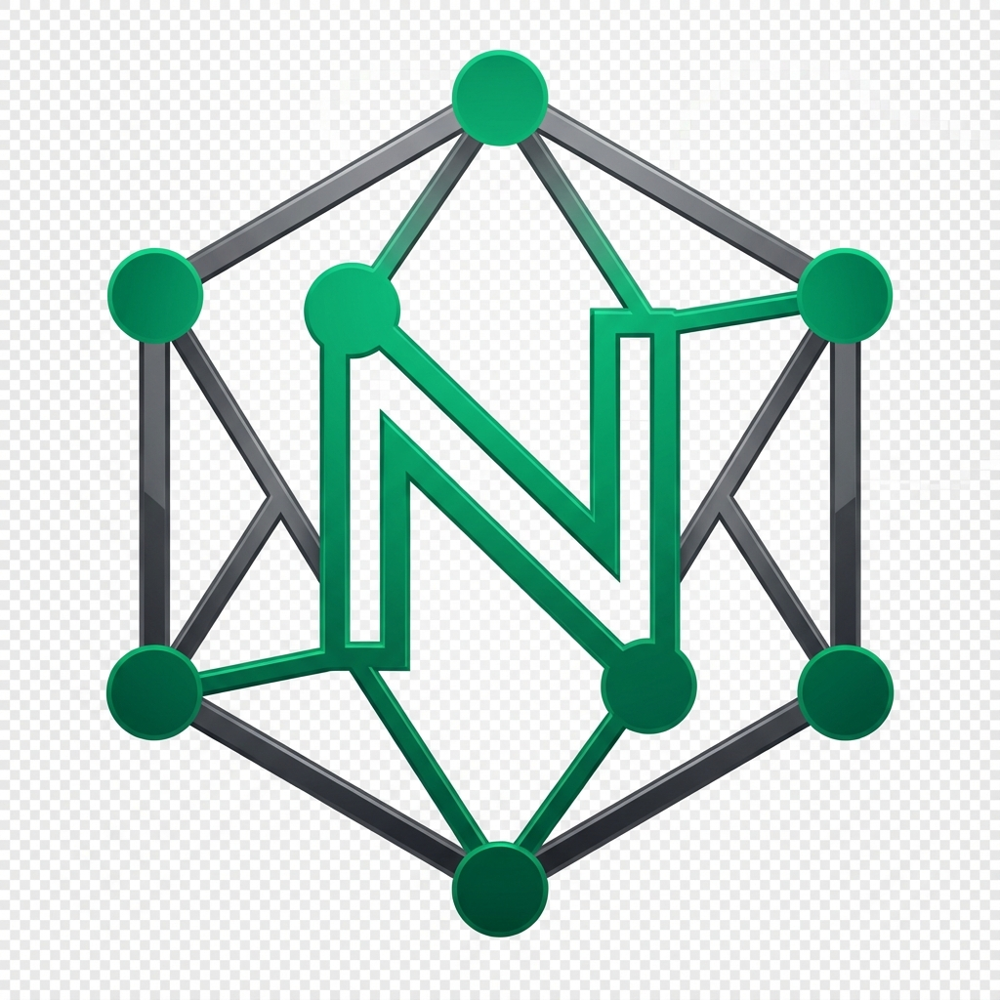

<p align="center">
  
</p>

<h1 align="center">NeoHub</h1>
<p align="center"><b>The Neo N3 MiniApp Platform</b></p>

<p align="center">
  <a href="https://neomini.app"></a>
  <a href="#quick-start"></a>
  <a href="docs/ARCHITECTURE.md"></a>
  <a href="#platform-contracts"></a>
  <a href="https://github.com/R3E-Network"></a>
</p>

---

# NeoHub

A TEE-powered miniapp platform for Neo N3 that combines a user-facing **Gateway** (Supabase Edge) with enclave workloads (MarbleRun + EGo) for secure signing and confidential computation.

## Overview

The Neo MiniApp Platform provides infrastructure for building decentralized MiniApps on Neo N3 with:

- **60+ Production MiniApps** across Gaming, DeFi, Social, NFT, and Governance categories
- **TEE Security** via Intel SGX enclaves for confidential computation
- **Provable Randomness** through VRF with on-chain attestation
- **Real-time Price Feeds** from multiple oracle sources
- **Automated Workflows** with cron-based task scheduling
- **Confidential Computing** enables confidential preserving operations

## Architecture

```
┌─────────────────────────────────────────────────────────────────┐
│                        MiniApp Frontend                         │
│                    (React/Next.js + SDK)                        │
└─────────────────────────────────────────────────────────────────┘
                              │
                              ▼
┌─────────────────────────────────────────────────────────────────┐
│                     Supabase Edge Gateway                       │
│              (Auth, Rate Limiting, Request Routing)             │
└─────────────────────────────────────────────────────────────────┘
                              │
              ┌───────────────┼───────────────┐
              ▼               ▼               ▼
┌─────────────────┐ ┌─────────────────┐ ┌─────────────────┐
│   TEE Services  │ │  TEE Services   │ │  TEE Services   │
│   (VRF, Oracle) │ │ (Compute, Auto) │ │  (GlobalSigner) │
└─────────────────┘ └─────────────────┘ └─────────────────┘
                              │
                              ▼
┌─────────────────────────────────────────────────────────────────┐
│                      Neo N3 Blockchain                          │
│        (Platform Contracts + MiniApp Contracts)                 │
└─────────────────────────────────────────────────────────────────┘
```

For detailed architecture, see [`docs/ARCHITECTURE.md`](docs/ARCHITECTURE.md).

## Services

| Service        | ID              | Description                                          |
| -------------- | --------------- | ---------------------------------------------------- |
| **VRF**        | `neovrf`        | Verifiable random function with on-chain attestation |
| **DataFeed**   | `neofeeds`      | Real-time price feeds from multiple sources          |
| **Automation** | `neoflow`       | Cron-based task scheduling and execution             |
| **Compute**    | `neocompute`    | Confidential computation in TEE                      |
| **Oracle**     | `neooracle`     | External data queries with TEE verification          |
| **TxProxy**    | `txproxy`       | Transaction submission and gas management            |
| **GasBank**    | `neogasbank`    | User GAS balance management                          |
| **Simulation** | `neosimulation` | Development and testing environment                  |

**Infrastructure:**

- `globalsigner` - Enclave-held signing keys
- `neoaccounts` - HD-derived account pool (10,000+ accounts)

## Platform Contracts

Deployed on Neo N3 Testnet:

| Contract            | Address                              | Description               |
| ------------------- | ------------------------------------ | ------------------------- |
| PaymentHub          | `NLyxAiXdbc7pvckLw8aHpEiYb7P7NYHpQq` | GAS payment processing    |
| Governance          | `NeEWK3vcVRWJDebyBCyLx6HSzJZSeYhXAt` | NEO staking and voting    |
| PriceFeed           | `Ndx6Lia3FsF7K1t73F138HXHaKwLYca2yM` | Oracle price data         |
| RandomnessLog       | `NWkXBKnpvQTVy3exMD2dWNDzdtc399eLaD` | VRF attestation anchoring |
| AppRegistry         | `NX25pqQJSjpeyKBvcdReRtzuXMeEyJkyiy` | MiniApp registration      |
| AutomationAnchor    | `NNWqgxGnXGtfK7VHvEqbdSu3jq8Pu8xkvM` | Periodic task scheduling  |
| ServiceLayerGateway | `NPXyVuEVfp47Abcwq6oTKmtwbJM6Yh965c` | Service request routing   |

## MiniApps (62 Apps)

All MiniApp contracts use the shared `MiniAppContract` partial class pattern and communicate with platform services via ServiceLayerGateway.

### 🎮 Gaming (15 Apps)

| App             | Contract               | Description                       |
| --------------- | ---------------------- | --------------------------------- |
| Lottery         | `MiniAppLottery`       | Provable VRF lottery with jackpot |
| Coin Flip       | `MiniAppCoinFlip`      | 50/50 double-or-nothing           |
| Dice Game       | `MiniAppDiceGame`      | Roll dice, win up to 6x           |
| Scratch Card    | `MiniAppScratchCard`   | Instant win scratch cards         |
| Neo Crash       | `MiniAppNeoCrash`      | Multiplier crash game             |
| No-Loss Lottery | `MiniAppNoLossLottery` | Stake to win, keep principal      |
| Fog Chess       | `MiniAppFogChess`      | Chess with fog of war             |
| Fog Puzzle      | `MiniAppFogPuzzle`     | Hidden puzzle solving             |
| Secret Poker    | `MiniAppSecretPoker`   | TEE Texas Hold'em                 |
| Algo Battle     | `MiniAppAlgoBattle`    | Algorithm competition             |
| Puzzle Mining   | `MiniAppPuzzleMining`  | Solve puzzles to earn             |
| Crypto Riddle   | `MiniAppCryptoRiddle`  | Cryptographic puzzles             |
| On-Chain Tarot  | `MiniAppOnChainTarot`  | VRF-based tarot readings          |
| World Piano     | `MiniAppWorldPiano`    | Collaborative music creation      |
| Scream to Earn  | `MiniAppScreamToEarn`  | Voice-activated rewards           |

### 💰 DeFi (14 Apps)

| App               | Contract                  | Description                 |
| ----------------- | ------------------------- | --------------------------- |
| Flash Loan        | `MiniAppFlashLoan`        | Instant borrow and repay    |
| Grid Bot          | `MiniAppGridBot`          | Automated grid trading      |
| AI Trader         | `MiniAppAITrader`         | Autonomous trading agent    |
| Price Ticker      | `MiniAppPriceTicker`      | Real-time price feeds       |
| Prediction Market | `MiniAppPredictionMarket` | Price movement predictions  |
| IL Guard          | `MiniAppILGuard`          | Impermanent loss protection |
| Candle Wars       | `MiniAppCandleWars`       | Price candle predictions    |
| Dark Pool         | `MiniAppDarkPool`         | Anonymous large trades      |
| Dutch Auction     | `MiniAppDutchAuction`     | Descending price auctions   |
| Self Loan         | `MiniAppSelfLoan`         | Self-collateralized loans   |
| Compound Capsule  | `MiniAppCompoundCapsule`  | Auto-compounding yields     |
| Quantum Swap      | `MiniAppQuantumSwap`      | Atomic token swaps          |
| Melting Asset     | `MiniAppMeltingAsset`     | Time-decaying tokens        |
| NeoBurger         | External Integration      | NEO staking for GAS rewards |

### 👥 Social (12 Apps)

| App              | Contract                 | Description               |
| ---------------- | ------------------------ | ------------------------- |
| Red Envelope     | `MiniAppRedEnvelope`     | Social GAS red packets    |
| Gas Circle       | `MiniAppGasCircle`       | Daily savings circle      |
| Secret Vote      | `MiniAppSecretVote`      | Privacy-preserving voting |
| Whisper Chain    | `MiniAppWhisperChain`    | Anonymous messaging       |
| Dev Tipping      | `MiniAppDevTipping`      | Developer appreciation    |
| Bounty Hunter    | `MiniAppBountyHunter`    | Bug bounty platform       |
| Breakup Contract | `MiniAppBreakupContract` | Relationship agreements   |
| Ex Files         | `MiniAppExFiles`         | Shared memory vault       |
| AI Soulmate      | `MiniAppAISoulmate`      | AI companion matching     |
| Geo Spotlight    | `MiniAppGeoSpotlight`    | Location-based discovery  |
| Masquerade DAO   | `MiniAppMasqueradeDAO`   | Anonymous governance      |
| Dark Radio       | `MiniAppDarkRadio`       | Anonymous broadcasting    |

### 🎨 NFT (8 Apps)

| App               | Contract                 | Description                 |
| ----------------- | ------------------------ | --------------------------- |
| Canvas            | `MiniAppCanvas`          | Collaborative pixel art NFT |
| NFT Evolve        | `MiniAppNFTEvolve`       | Dynamic NFT evolution       |
| NFT Chimera       | `MiniAppNFTChimera`      | NFT fusion and breeding     |
| Schrodinger NFT   | `MiniAppSchrodingerNFT`  | Quantum state NFTs          |
| Garden of Neo     | `MiniAppGardenOfNeo`     | Virtual garden NFTs         |
| Million Piece Map | `MiniAppMillionPieceMap` | Collaborative world map     |
| Pay to View       | `MiniAppPayToView`       | Gated content access        |
| Graveyard         | `MiniAppGraveyard`       | NFT memorial                |

### 🏛️ Governance (6 Apps)

| App             | Contract                | Description               |
| --------------- | ----------------------- | ------------------------- |
| Gov Booster     | `MiniAppGovBooster`     | NEO governance tools      |
| Candidate Vote  | `MiniAppCandidateVote`  | Vote for consensus nodes  |
| Gov Merc        | `MiniAppGovMerc`        | Governance delegation     |
| Guardian Policy | `MiniAppGuardianPolicy` | TEE transaction security  |
| Bridge Guardian | `MiniAppBridgeGuardian` | Cross-chain asset bridge  |
| Burn League     | `MiniAppBurnLeague`     | Token burning competition |

### 🔧 Utility (7 Apps)

| App               | Contract                  | Description                |
| ----------------- | ------------------------- | -------------------------- |
| Time Capsule      | `MiniAppTimeCapsule`      | Time-locked messages       |
| Dead Switch       | `MiniAppDeadSwitch`       | Dead man's switch          |
| Heritage Trust    | `MiniAppHeritageTrust`    | Digital inheritance        |
| Unbreakable Vault | `MiniAppUnbreakableVault` | Secure asset storage       |
| ZK Badge          | `MiniAppZKBadge`          | Zero-knowledge credentials |
| Doomsday Clock    | `MiniAppDoomsdayClock`    | Countdown events           |
| Parasite          | `MiniAppParasite`         | Token attachment protocol  |

## Quick Start

### Prerequisites

- Go 1.21+
- Docker & Docker Compose
- Node.js 18+
- Neo N3 wallet with testnet GAS

### Local Development

```bash
# Start infrastructure
make docker-up

# Run a service locally
SERVICE_TYPE=neovrf go run ./cmd/marble

# Start the host app
cd platform/host-app && npm run dev
```

### Full Stack (K3s)

```bash
./scripts/bootstrap_k3s_dev.sh --env-file .env --edge-env-file .env.local
```

See [`docs/LOCAL_DEV.md`](docs/LOCAL_DEV.md) for detailed setup.

## Environment Variables

| Variable                    | Description                |
| --------------------------- | -------------------------- |
| `SUPABASE_URL`              | Supabase project URL       |
| `SUPABASE_SERVICE_ROLE_KEY` | Supabase service role key  |
| `SECRETS_MASTER_KEY`        | Encryption key for secrets |
| `NEO_RPC_URL`               | Neo N3 RPC endpoint        |
| `NEO_NETWORK_MAGIC`         | Network magic number       |
| `CONTRACT_*_HASH`           | Platform contract hashes   |

See [`.env.example`](.env.example) for complete list.

## Repository Structure

```
├── cmd/                    # Binary entrypoints
├── contracts/              # Neo N3 smart contracts (C#)
├── infrastructure/         # Shared infrastructure (Go)
│   ├── globalsigner/       # TEE signing service
│   └── accountpool/        # HD account management
├── services/               # Product services (Go)
│   ├── vrf/                # Verifiable random function
│   ├── datafeed/           # Price feed aggregation
│   ├── automation/         # Task scheduling
│   └── ...
├── platform/               # Frontend & Gateway
│   ├── edge/               # Supabase Edge functions
│   ├── host-app/           # Next.js host application
│   └── sdk/                # MiniApp JavaScript SDK
├── docs/                   # Documentation
└── scripts/                # Build and deploy scripts
```

## Documentation

| Document                                          | Description                          |
| ------------------------------------------------- | ------------------------------------ |
| [ARCHITECTURE.md](docs/ARCHITECTURE.md)           | System architecture and TEE boundary |
| [WORKFLOWS.md](docs/WORKFLOWS.md)                 | MiniApp lifecycle and callbacks      |
| [DATAFLOWS.md](docs/DATAFLOWS.md)                 | Request flows and audit tables       |
| [API_DOCUMENTATION.md](docs/API_DOCUMENTATION.md) | Gateway and service APIs             |
| [DEPLOYMENT_GUIDE.md](docs/DEPLOYMENT_GUIDE.md)   | Deployment paths                     |
| [sdk-guide.md](docs/sdk-guide.md)                 | MiniApp SDK integration              |

## License

Copyright © 2024 R3E Network. All rights reserved.
