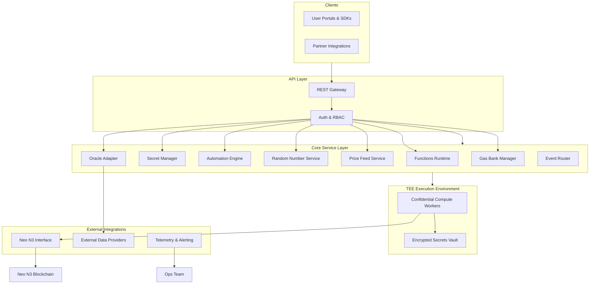
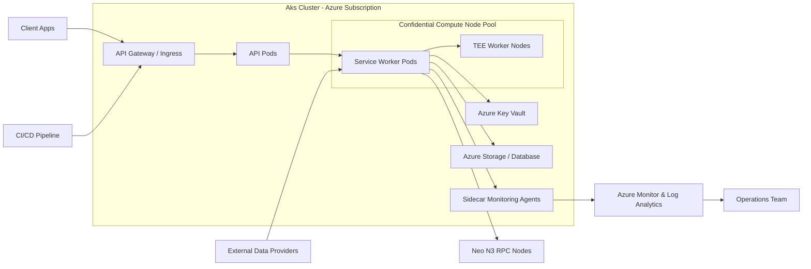

# Neo N3 Service Layer Architecture Overview

## Introduction
This document outlines the architecture of the Neo N3 Service Layer, a centralized oracle service similar to Chainlink but specifically designed for the Neo N3 blockchain. The service leverages Azure Confidential Computing for Trusted Execution Environment (TEE) capabilities.

## Core Services

The Neo N3 Service Layer offers the following core services:

1. **Functions Service**: JavaScript functions execution in TEE
2. **Secret Management**: Secure storage and usage of user secrets
3. **Contract Automation**: Event-based triggers for smart contract functions
4. **Gas Bank**: Efficient gas management for service operations
5. **Random Number Generation**: Secure random number generation for contracts
6. **Price Feed**: Regular on-chain token price updates
7. **Oracle Service**: Bringing external data to Neo N3 blockchain

## High-Level Architecture

```
┌────────────────────────────────────────────────────────────────────┐
│                          API Layer                                 │
├────────────┬────────────┬────────────┬────────────┬────────────────┤
│ Functions  │  Secret    │ Contract   │ Random     │  Price Feed    │
│ Service    │ Management │ Automation │ Generator  │  Service       │
├────────────┴────────────┴────────────┴────────────┴────────────────┤
│                      Core Service Layer                            │
├─────────────────────────┬──────────────────────────────────────────┤
│    TEE Environment      │           Gas Bank                       │
├─────────────────────────┴──────────────────────────────────────────┤
│                     Neo N3 Blockchain Interface                    │
└────────────────────────────────────────────────────────────────────┘
```

## Logical Architecture Diagram



The logical diagram highlights the flow from user-facing entry points through the core platform services, into the TEE-backed execution layer, and out to blockchain and external data integrations.

## Deployment Diagram



This deployment view shows how user traffic reaches the cluster, the split between API pods and confidential compute workloads, and the surrounding Azure services supporting secure execution, persistence, monitoring, and blockchain connectivity.

## Components

### API Layer
Exposes RESTful endpoints for users to interact with the service.

### Core Service Layer
Implements business logic for all core services.

### TEE Environment
Ensures secure execution of user functions and secure storage of sensitive data.

### Gas Bank
Manages gas fees for on-chain operations.

### Neo N3 Blockchain Interface
Handles communication with the Neo N3 blockchain.

## Security Considerations

- All sensitive operations occur within the TEE
- User secrets are encrypted and only accessible within the TEE
- Authentication and authorization for all API endpoints

## Data Flow

1. User requests go through the API Layer
2. Requests are processed by the Core Service Layer
3. Operations requiring security guarantees are executed in the TEE
4. Neo N3 Blockchain Interface handles all blockchain interactions
5. Response is returned to the user via the API Layer

## Monitoring and Reliability

The system includes comprehensive monitoring, logging, and alerting to ensure high availability and reliability.
